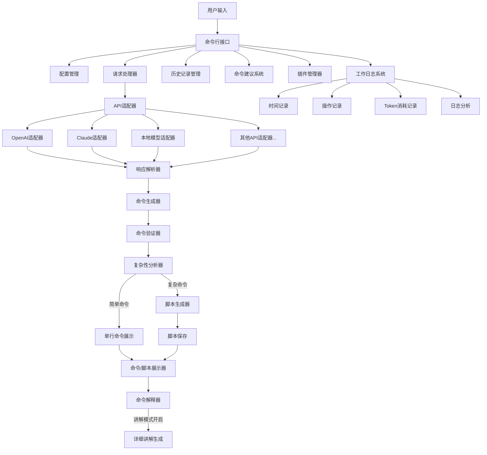
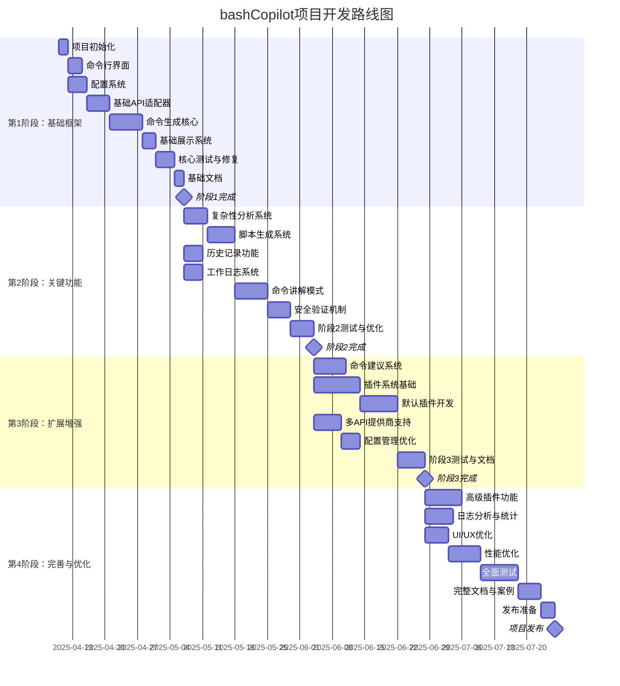
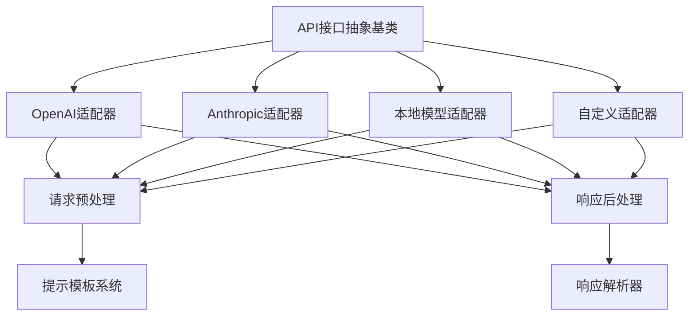

# bashCopilot 开发者计划文档

## 1. 项目概述

bashCopilot 是一个命令行智能助手应用，旨在帮助不熟悉 Linux 命令的用户将自然语言转换为可执行的命令行操作。用户只需通过 `bcopilot "查找最大的文件"` 这样的方式调用，系统即可生成对应的命令，并提供详细解释。

### 1.1 项目目标

- 为不熟悉 Linux 命令的用户提供直观的命令行助手
- 支持自然语言到命令行操作的精确转换
- 提供命令解释和教学功能
- 具备可扩展性，支持插件系统
- 支持多种 AI 服务提供商
- 保持良好的性能和用户体验

### 1.2 用户价值

- 降低 Linux 命令学习曲线
- 提高命令行使用效率
- 通过讲解功能学习 Linux 命令
- 自动生成复杂脚本，简化工作流程

## 2. 系统架构



## 3. 核心功能

### 3.1 基础功能
- 自然语言到命令行的转换
- 多种 API 服务提供商支持
- 命令展示和解释
- 命令历史记录

### 3.2 高级功能
- 复杂性分析与脚本生成
- 命令讲解模式
- 命令建议系统
- 工作日志和 Token 统计
- 插件系统

### 3.3 安全功能
- 命令验证机制
- 敏感操作警告
- 权限检查

## 4. 文件结构

```
bashCopilot-next/
├── LICENSE
├── README.md
├── setup.py
├── requirements.txt
├── docs/
│   ├── index.md                  # 文档首页
│   ├── installation.md           # 安装指南
│   ├── getting-started.md        # 入门教程
│   ├── configuration.md          # 配置指南
│   ├── api-integration.md        # API集成指南
│   ├── plugins.md                # 插件开发指南
│   ├── script-mode.md            # 脚本模式文档
│   ├── logging.md                # 日志系统文档
│   ├── explain-mode.md           # 讲解模式文档
│   └── examples/                 # 使用示例
├── bin/
│   └── bcopilot                  # 可执行入口文件
├── bashcopilot/
│   ├── __init__.py
│   ├── cli.py                    # 命令行接口
│   ├── config.py                 # 配置管理
│   ├── api/
│   │   ├── __init__.py
│   │   ├── base.py               # API基类
│   │   ├── openai.py             # OpenAI适配器
│   │   ├── anthropic.py          # Claude适配器
│   │   └── local.py              # 本地模型适配器
│   ├── templates/
│   │   ├── __init__.py
│   │   ├── openai.json           # OpenAI提示模板
│   │   ├── anthropic.json        # Claude提示模板
│   │   ├── local.json            # 本地模型提示模板
│   │   └── explain/              # 讲解模式模板
│   │       ├── basic.json        # 基础讲解模板
│   │       └── detailed.json     # 详细讲解模板
│   ├── history/
│   │   ├── __init__.py
│   │   ├── manager.py            # 历史记录管理
│   │   └── suggestion.py         # 命令建议生成
│   ├── plugins/
│   │   ├── __init__.py
│   │   ├── manager.py            # 插件管理器
│   │   ├── base.py               # 插件基类
│   │   └── default/              # 默认插件
│   │       ├── __init__.py
│   │       ├── file_operations.py
│   │       ├── system_info.py
│   │       └── network_tools.py
│   ├── logging/                  # 日志系统
│   │   ├── __init__.py
│   │   ├── logger.py             # 日志记录核心
│   │   ├── token_counter.py      # Token计数工具
│   │   └── analyzer.py           # 日志分析工具
│   ├── utils/
│   │   ├── __init__.py
│   │   ├── command.py            # 命令生成和验证
│   │   ├── display.py            # 命令展示
│   │   ├── security.py           # 安全检查
│   │   ├── complexity.py         # 复杂性分析
│   │   ├── script_generator.py   # 脚本生成器
│   │   └── explainer.py          # 命令讲解生成器
│   └── executor.py               # 命令展示（不执行）
└── tests/                        # 单元测试
    ├── __init__.py
    ├── test_cli.py
    ├── test_api.py
    ├── test_history.py
    ├── test_plugins.py
    ├── test_command.py
    ├── test_complexity.py
    ├── test_script_gen.py
    └── test_logging.py
```

## 5. 开发路线图

### 5.1 总体时间线



### 5.2 阶段划分与优先级

#### 第1阶段：基础框架（约30天）

**目标**：实现最小可行产品(MVP)，可以接收用户自然语言输入并生成基本的shell命令

| 任务 | 优先级 | 估计时间(天) | 依赖 | 说明 |
|------|--------|-------------|------|------|
| 项目初始化 | P0 | 2 | 无 | 创建基本项目结构，设置开发环境，创建Git仓库 |
| 命令行界面 | P0 | 3 | 项目初始化 | 实现基本的CLI框架，参数解析系统 |
| 配置系统 | P0 | 4 | 项目初始化 | 用户配置管理，API密钥管理 |
| 基础API适配器 | P0 | 5 | 配置系统 | 先支持一个API提供商（优先OpenAI），实现基本请求/响应流程 |
| 命令生成核心 | P0 | 7 | 基础API适配器 | 自然语言到命令的转换核心逻辑，基本提示模板 |
| 基础展示系统 | P0 | 3 | 命令生成核心 | 简单的命令展示功能 |
| 核心测试与修复 | P1 | 4 | 基础展示系统 | 针对基础功能的测试和修复 |
| 基础文档 | P1 | 2 | 核心测试与修复 | 安装和基本使用说明 |

#### 第2阶段：关键功能（约35天）

**目标**：实现所有核心功能，使产品具备实用价值

| 任务 | 优先级 | 估计时间(天) | 依赖 | 说明 |
|------|--------|-------------|------|------|
| 复杂性分析系统 | P0 | 5 | 阶段1完成 | 命令复杂度判断逻辑 |
| 脚本生成系统 | P0 | 6 | 复杂性分析系统 | 复杂命令脚本生成与管理 |
| 历史记录功能 | P1 | 4 | 阶段1完成 | 命令历史存储与查询 |
| 工作日志系统 | P1 | 4 | 阶段1完成 | Token使用、时间记录 |
| 命令讲解模式 | P0 | 7 | 脚本生成系统 | 详细的命令解释功能 |
| 安全验证机制 | P1 | 5 | 命令讲解模式 | 命令安全检查与提示 |
| 阶段2测试与优化 | P1 | 5 | 安全验证机制 | 全面测试和性能优化 |

#### 第3阶段：扩展增强（约40天）

**目标**：添加高级功能，提升用户体验和扩展性

| 任务 | 优先级 | 估计时间(天) | 依赖 | 说明 |
|------|--------|-------------|------|------|
| 命令建议系统 | P1 | 7 | 阶段2完成 | 基于历史和上下文的命令建议 |
| 插件系统基础 | P0 | 10 | 阶段2完成 | 插件基础架构，插件管理 |
| 默认插件开发 | P1 | 8 | 插件系统基础 | 开发基础插件(文件操作、系统信息等) |
| 多API提供商支持 | P1 | 6 | 阶段2完成 | 增加更多API提供商支持(Claude等) |
| 配置管理优化 | P2 | 4 | 多API提供商支持 | 增强配置系统，支持更多自定义选项 |
| 阶段3测试与文档 | P1 | 6 | 默认插件开发, 配置管理优化 | 测试和文档更新 |

#### 第4阶段：完善与优化（约40天）

**目标**：全面优化产品，提高稳定性和易用性，准备正式发布

| 任务 | 优先级 | 估计时间(天) | 依赖 | 说明 |
|------|--------|-------------|------|------|
| 高级插件功能 | P2 | 8 | 阶段3完成 | 插件间通信，高级API，插件市场概念 |
| 日志分析与统计 | P2 | 6 | 阶段3完成 | Token使用分析，使用统计和报告 |
| UI/UX优化 | P1 | 5 | 阶段3完成 | 改进命令行界面，增加颜色和格式 |
| 性能优化 | P1 | 7 | UI/UX优化 | 提高响应速度，减少资源占用 |
| 全面测试 | P0 | 8 | 性能优化 | 全面的单元测试和集成测试 |
| 完整文档与案例 | P0 | 5 | 全面测试 | 详细文档，使用案例和教程 |
| 发布准备 | P0 | 3 | 完整文档与案例 | 准备打包，CI/CD设置 |

### 5.3 优先级说明

- **P0**：必须完成，核心功能
- **P1**：应该完成，重要功能
- **P2**：希望完成，增强功能

## 6. 技术选择

### 6.1 语言和框架
- **主要语言**：Python 3.8+
- **CLI框架**：Click 或 Typer
- **配置管理**：PyYAML
- **HTTP客户端**：Requests 或 aiohttp

### 6.2 依赖组件
- **命令行格式化**：Rich 或 Colorama
- **本地存储**：SQLite
- **测试框架**：Pytest
- **API客户端**：各服务商官方SDK或自定义客户端

### 6.3 开发工具
- **版本控制**：Git
- **文档生成**：MkDocs 或 Sphinx
- **代码风格**：Black + Flake8
- **类型检查**：Mypy

## 7. API 集成

### 7.1 支持的服务提供商
- OpenAI (GPT-3.5/GPT-4)
- Anthropic (Claude)
- 本地模型支持
- 其他可扩展的服务商

### 7.2 API抽象层


## 8. 插件系统

### 8.1 插件类型
- 命令增强插件
- 特定领域支持插件
- 工具集成插件
- 用户界面增强插件

### 8.2 插件接口
```python
class BasePlugin:
    """基础插件接口"""
    
    def __init__(self, config=None):
        self.config = config or {}
        
    @property
    def name(self) -> str:
        """插件名称"""
        raise NotImplementedError
    
    @property
    def description(self) -> str:
        """插件描述"""
        raise NotImplementedError
    
    @property
    def version(self) -> str:
        """插件版本"""
        raise NotImplementedError
    
    def initialize(self) -> bool:
        """初始化插件"""
        return True
    
    def pre_process(self, query: str) -> str:
        """请求预处理"""
        return query
    
    def post_process(self, command: str) -> str:
        """命令后处理"""
        return command
    
    def get_suggestions(self, command: str) -> List[str]:
        """获取命令建议"""
        return []
    
    def cleanup(self) -> None:
        """插件清理"""
        pass
```

## 9. 配置系统

### 9.1 配置文件示例
```yaml
# ~/.config/bashcopilot/config.yml

# 基本设置
general:
  language: "zh-CN"  # 界面语言
  explain_mode: false  # 默认是否开启讲解模式
  explain_level: "basic"  # 讲解详细程度 (basic, detailed, expert)
  script_dir: "~/.bashcopilot/scripts"  # 脚本保存目录
  complexity_threshold: 3  # 复杂度阈值 (1-10)

# API配置
api:
  default_provider: "openai"  # 默认API提供商
  providers:
    openai:
      api_key: "sk-..."
      model: "gpt-4-turbo"  # 或其他模型
      temperature: 0.3
    anthropic:
      api_key: "sk-ant-..."
      model: "claude-3-opus-20240229"
      temperature: 0.2
    # 其他提供商...

# 提示模板
templates:
  command_generation: "default"  # 使用的提示模板
  customize: false  # 是否使用自定义提示

# 历史记录
history:
  enabled: true
  max_entries: 1000
  retention_days: 90
  suggestions_enabled: true  # 是否启用建议功能

# 日志设置
logging:
  enabled: true
  log_dir: "~/.bashcopilot/logs"
  level: "info"  # debug, info, warning, error
  token_tracking: true  # 是否跟踪token使用
  retention_days: 30

# 插件设置
plugins:
  enabled: true
  auto_update: false
  allow_network: true  # 是否允许插件访问网络
```

## 10. 开发指南

### 10.1 开发环境设置
```bash
# 克隆仓库
git clone https://github.com/yourusername/bashCopilot-next.git
cd bashCopilot-next

# 创建虚拟环境
python -m venv venv
source venv/bin/activate  # Linux/Mac
# 或 venv\Scripts\activate  # Windows

# 安装依赖
pip install -e ".[dev]"  # 安装项目及开发依赖
```

### 10.2 代码风格指南
- 遵循PEP 8风格指南
- 使用类型注解
- 为所有函数和类编写文档字符串
- 使用有意义的变量和函数命名

### 10.3 测试指南
- 为所有核心功能编写单元测试
- 使用模拟对象测试API调用
- 测试覆盖率目标：>80%
- 集成测试验证主要工作流程

## 11. GitHub仓库设置

### 11.1 仓库结构
- `main` 分支：稳定版本
- `develop` 分支：开发版本
- 功能分支：`feature/` 前缀
- 修复分支：`bugfix/` 前缀
- 发布分支：`release/` 前缀

### 11.2 Issue模板
- Bug报告模板
- 功能请求模板
- 文档改进模板

### 11.3 拉取请求流程
1. 创建分支
2. 实现更改
3. 添加测试
4. 更新文档
5. 提交PR
6. 代码审查
7. 合并

### 11.4 CI/CD配置
- 自动运行测试
- 代码质量检查
- 生成文档
- 构建分发包

## 12. 贡献指南

### 12.1 如何贡献
- 报告Bug
- 提交Pull Request
- 改进文档
- 提出新功能建议

### 12.2 贡献流程
1. Fork仓库
2. 创建功能分支
3. 提交更改
4. 推送到分支
5. 创建Pull Request

### 12.3 行为准则
- 尊重社区成员
- 遵循项目指南
- 积极参与讨论
- 接受建设性批评

## 13. 许可证

项目采用 MIT 许可证。详见 [LICENSE](LICENSE) 文件。

---

该文档旨在为开发者提供全面的项目指南，确保开发工作有条不紊地进行，并保持代码质量和项目一致性。随着项目的进展，本文档将会更新和完善。